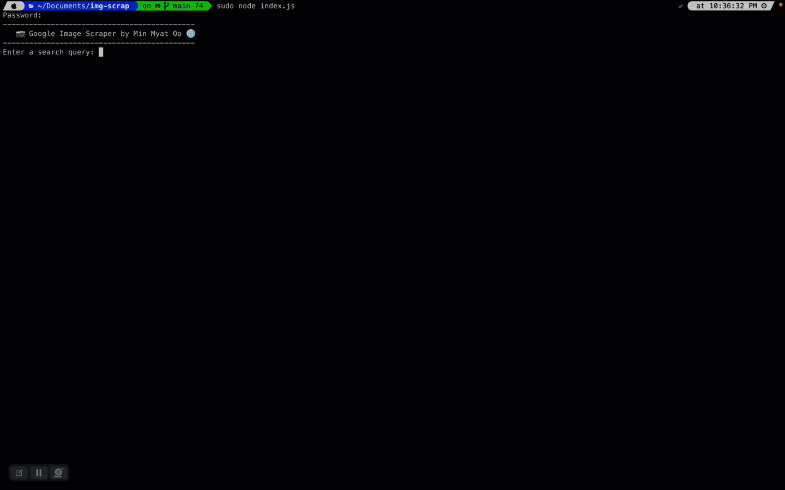

# 📷 Google Image Scraper



This Node.js script allows you to scrape images from Google Images based on a query and save them to a specified directory. 🌐

## 🚀 Getting Started

### Prerequisites

Before you begin, ensure you have met the following requirements:

- Node.js installed
- npm (Node Package Manager) installed

### Installation

1. Clone the repository:

   ```bash
   git clone https://github.com/minmyatoo/google-image-scraper.git
   ```

2. Navigate to the project directory:

   ```bash
   cd google-image-scraper
   ```

3. Install the required dependencies:

   ```bash
   npm install
   ```

## 📦 Usage

To use the Google Image Scraper, follow these steps:

1. Run the script:

   ```bash
   npm start
   ```

2. Enter a search query when prompted.

3. Enter the number of images to download.

4. The script will start scraping images from Google Images and save them to the "output" directory.

## ⚙️ Configuration

You can modify the following parameters in the script:

- `outputDir`: The directory where the images will be saved. (Default: "./output")
- `delayBetweenRequests`: The delay in milliseconds between HTTP requests. (Default: 1000 ms)

## 📃 License

This project is licensed under the MIT License - see the [LICENSE](LICENSE) file for details.

## 🤝 Contributing

Contributions are welcome! Feel free to open an issue or submit a pull request.

## 📄 Author

- [Min Myat Oo](https://github.com/minmyatoo)

## 📝 Acknowledgments

- Thanks to the creators of Axios, Cheerio, cli-progress, and other libraries used in this project.
